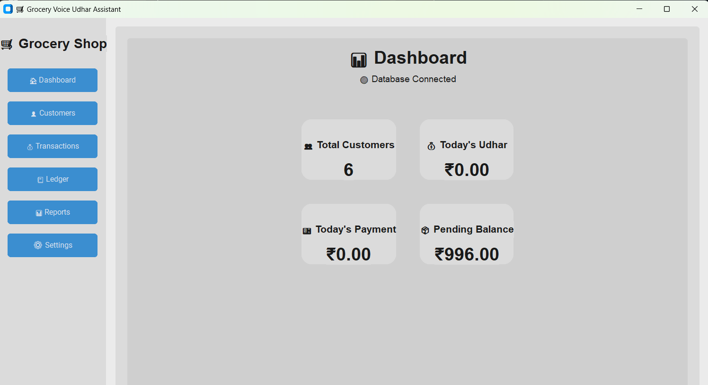
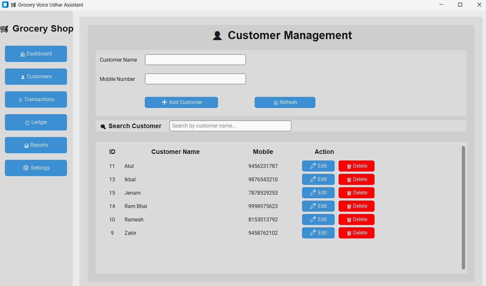
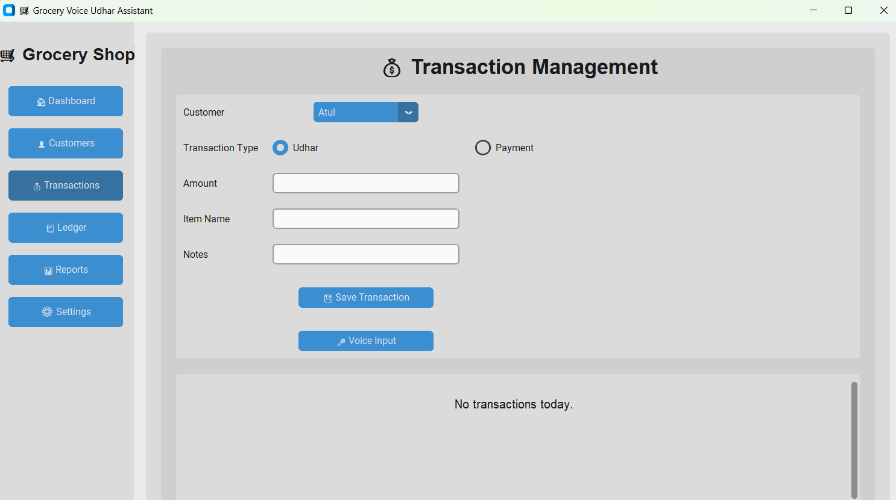
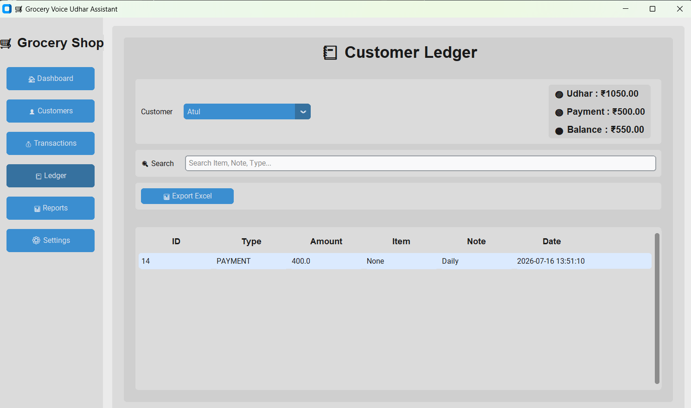
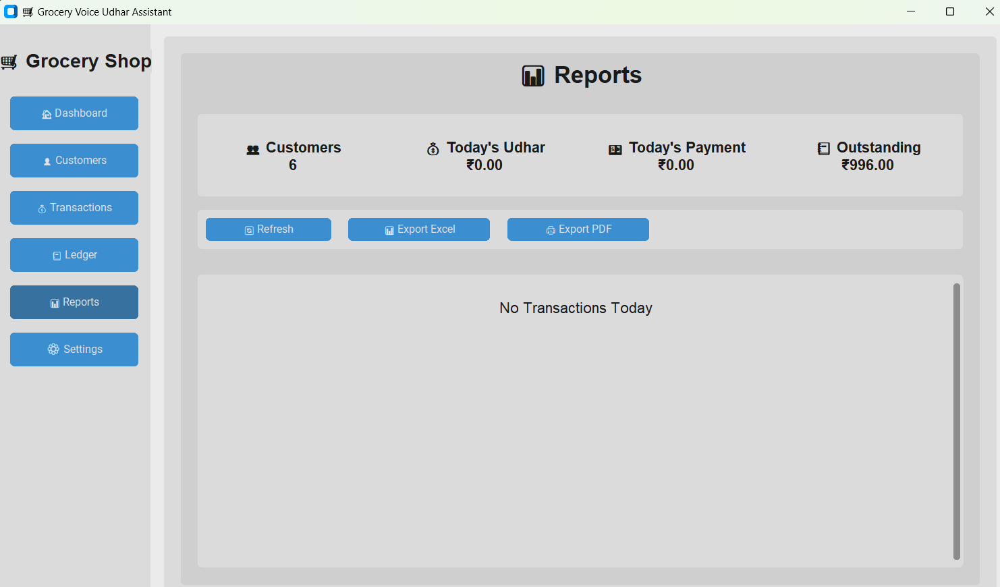
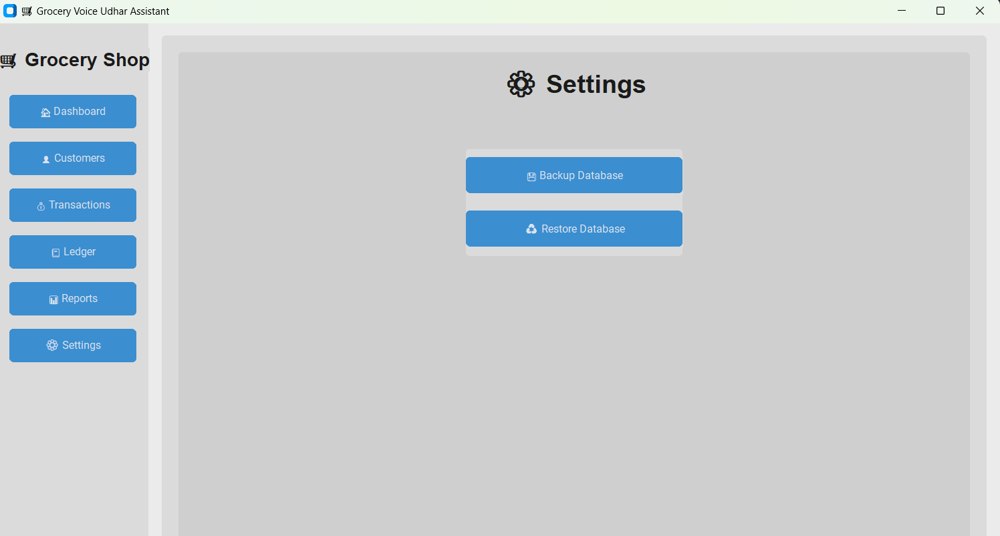

# 🛒 Grocery Voice Udhar Assistant

Python 3.12
MIT License
Version 1.0
Stable

A modern **Python Desktop Application** for grocery (kirana) shops to manage **Udhar (Credit)** records efficiently using a clean graphical interface, SQLite database, voice input, and professional reporting tools.

---

## ✨ Features

### 👤 Customer Management

- Add Customer
- Update Customer
- Delete Customer
- Search Customer
- Mobile Number Support

### 💰 Transaction Management

- Add Udhar
- Record Payment
- Customer Balance
- Transaction Notes
- Item Details

### 📒 Customer Ledger

- Complete Customer History
- Outstanding Balance
- Transaction Timeline

### 📊 Reports

- Daily Transactions
- Summary Dashboard
- Outstanding Amount
- Customer Statistics

### 📄 Export

- Excel Export (.xlsx)
- PDF Report Export

### 💾 Backup & Restore

- Database Backup
- Database Restore

### 🎤 Voice Assistant

- Voice-based Transaction Entry
- Customer Name Recognition
- Item Recognition
- Amount Recognition
- Gujarati Voice Workflow (Version 1)

---

## 🛠️ Technologies Used

- Python 3
- CustomTkinter
- SQLite
- OpenAI Whisper
- pyttsx3
- OpenPyXL
- ReportLab
- Pandas

---

# 📸 Application Screenshots

## 🏠 Dashboard



---

## 👤 Customer Management



---

## 💰 Transactions



---

## 📒 Customer Ledger



---

## 📊 Reports



---

## ⚙️ Settings



---

# 📂 Project Structure

```text
Grocery-Voice-Udhar-Assistant/
│
├── database/
├── screenshots/
├── src/
│   ├── dashboard.py
│   ├── customer_page.py
│   ├── transaction_page.py
│   ├── ledger_page.py
│   ├── report_page.py
│   ├── settings_page.py
│   ├── database.py
│   ├── customer_manager.py
│   ├── transaction_manager.py
│   ├── report_manager.py
│   ├── backup_manager.py
│   ├── voice_assistant.py
│   ├── voice_parser.py
│   ├── tts.py
│   ├── config.py
│   └── gui.py
│
├── requirements.txt
├── README.md
└── .gitignore
```

---

# ⚙️ Installation

Clone the repository

```bash
git clone https://github.com/maharshidabgar/Grocery-Voice-Udhar-Assistant.git
```

Go to the project folder

```bash
cd Grocery-Voice-Udhar-Assistant
```

Create a virtual environment

```bash
python -m venv .venv
```

Activate the virtual environment (Windows)

```bash
.venv\Scripts\activate
```

Install dependencies

```bash
pip install -r requirements.txt
```

Run the application

```bash
python src\gui.py
```
---

# 🚀 Future Improvements

The following features are planned for future releases:

- 🔊 Improved Gujarati Voice Recognition
- 📱 Mobile Application
- ☁️ Cloud Backup & Sync
- 📷 Barcode Scanner Support
- 📦 Product Inventory Management
- 📈 Monthly & Yearly Analytics
- 📤 WhatsApp Report Sharing
- 👥 Multi-User Login System

---

# 🤝 Contributing

Contributions, suggestions, and improvements are always welcome.

1. Fork the repository.
2. Create a new feature branch.
3. Commit your changes.
4. Open a Pull Request.

---

# 👨‍💻 Developer

**Maharshi Dabgar**

**M.Sc. IT Student | Aspiring Data Scientist | Python Developer**

### Connect with me

- GitHub: https://github.com/maharshidabgar
- LinkedIn: *(Add your LinkedIn profile URL here)*

---

# 📄 License

This project is licensed under the **MIT License**.

---

# ⭐ Support

If you found this project useful, please consider giving it a **⭐ Star** on GitHub.

Thank you for visiting this repository! ❤️